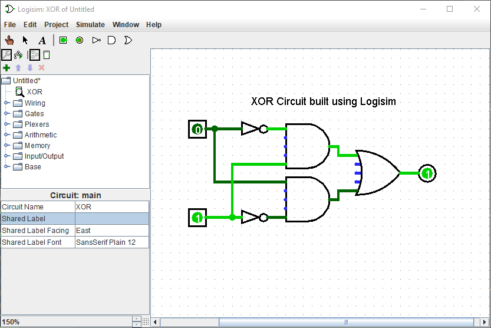

<!-- HEADER -->
<h1 align="center">
   
    
   
    Logisim
   
</h1>

<h4 align="center">A backup of the original Logisim circuit simulator.</h4>

<!-- SHIELDS -->

    <!-- Issues -->    
    
    <!-- License -->
    
    <!-- Codacy Grade -->
    

<!-- LINKS -->

  <a href="#about">About</a> •
  <a href="#features">Features</a> •
  <a href="#how-to-use">How To Use</a> •
  <a href="#contributing">Contributing</a>

<!-- SCREENSHOT -->
<!-- <h4 align="center">
   
    
   
    Screenshot of Logisim v2.7.3 running on Windows
   
</h4> -->

## About

This is a backup of the original Logisim source code which can be found on the original [Logisim website](http://www.cburch.com/logisim/).

Logisim is an educational tool for designing and simulating digital logic circuits. With its simple toolbar interface and simulation of circuits as you build them, it is simple enough to facilitate learning the most basic concepts related to logic circuits. With the capacity to build larger circuits from smaller subcircuits, and to draw bundles of wires with a single mouse drag, Logisim can be used (and is used) to design and simulate entire CPUs for educational purposes.

Logisim is used by students at colleges and universities around the world in many types of classes, ranging from a brief unit on logic in general-education computer science surveys, to computer organization courses, to full-semester courses on computer architecture.

This is a continuation of the original project since original development was ceased in October of 2014.

## Features

  * It runs on any machine supporting Java 8 or later; special versions are to be released later for MacOS X, Linux, and Windows. The cross-platform nature is important for students who have a variety of home/dorm computer systems.
  * The drawing interface is based on an intuitive toolbar. Color-coded wires aid in simulating and debugging a circuit.
  * The wiring tool draws horizontal and vertical wires, automatically connecting to components and to other wires. It's very easy to draw circuits!
  * Completed circuits can be saved into a file, exported to a GIF file, or printed on a printer.
  * Circuit layouts can be used as "subcircuits" of other circuits, allowing for hierarchical circuit design.
  * Included circuit components include inputs and outputs, gates, multiplexers, arithmetic circuits, flip-flops, and RAM memory.
  * The included "combinational analysis" module allows for conversion between circuits, truth tables, and Boolean expressions.
  
  See the [Features Status page]() on the project Wiki for information about the status of the above features as well as any additional plans for features

## How To Use
  This project is a WIP and is not currently building correctly (see the [issues](https://github.com/dadler64/Logisim/issues)) so I recommend going to the original [Logisim website](http://www.cburch.com/logisim/) and downloading it from there until the bulds here are up and running.
  
  If you want to try your hand at running or building what is here, import the project into an IDE such as IntelliJ IDEA and build it in there using the build system provided. 

## Contributing

  For now if you would like to contribute check out any open [issues](https://github.com/dadler64/Logisim/issues) which could be resolved.
